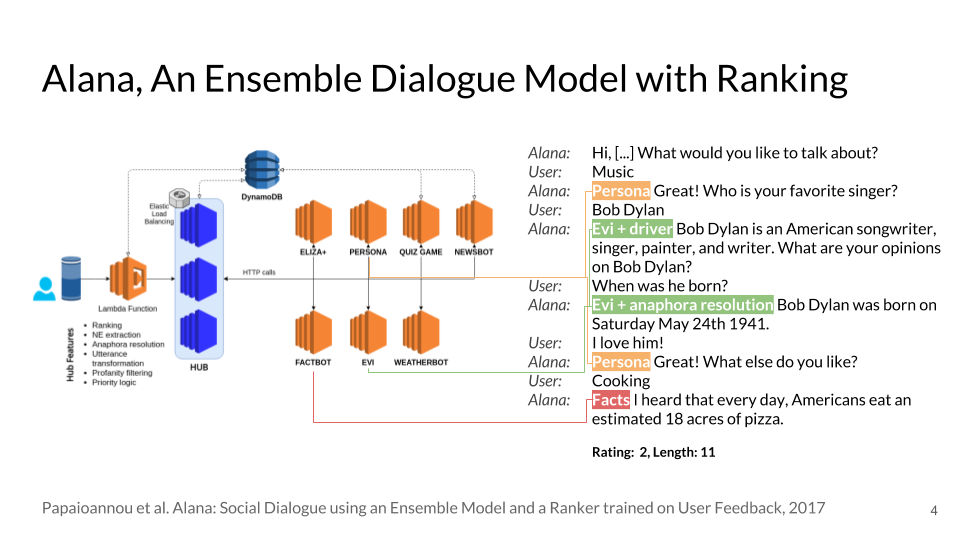

# Alana Learning to Rank 
Neural Response Ranker for Alana, Heriot-Watt University's Alexa Prize Socialbot

Code for the paper "Neural Response Ranking for Social Conversation: A Data-Efficient Approach" by [Igor Shalyminov](https://github.com/ishalyminov), [Ondřej Dušek](https://tuetschek.github.io/), and [Oliver Lemon](https://github.com/olemon1) (Search-Oriented Conversational AI, an EMNLP 2018 Workshop) [[Paper]](http://aclweb.org/anthology/W18-5701) [[Slides]](https://drive.google.com/open?id=1D0PIsJZUL6s0GuQhbWhxBERnKCdUb-EV).





# How To

1. Train a new model

```
python alana_learning_to_rank/learning_to_rank.py <trainset>.json <devset>.json <testset>json <model_folder>
```

2. Evaluate accuracy of a training model

```
python alana_learning_to_rank/evaluate.py <model_folder> <eval_dataset>.json
```

# Trained models

We provide 2 models trained from Alexa Prize dialogue transcripts, `length_model_1M` and `rating_model`, with length and rating targets respectively.

For a greater applicability, the models were trained without features involving bot names (which are specific to our setup), therefore the actual accuracy numbers might differ from reported ones.

# Data

Due to the copetition rules, we can't share any data containing real users' interactions with the system.
Therefore, we only provide examples of datasets for training and evaluation stages (`pandas json` dataframe format) which you can check with while collecting your own data.
